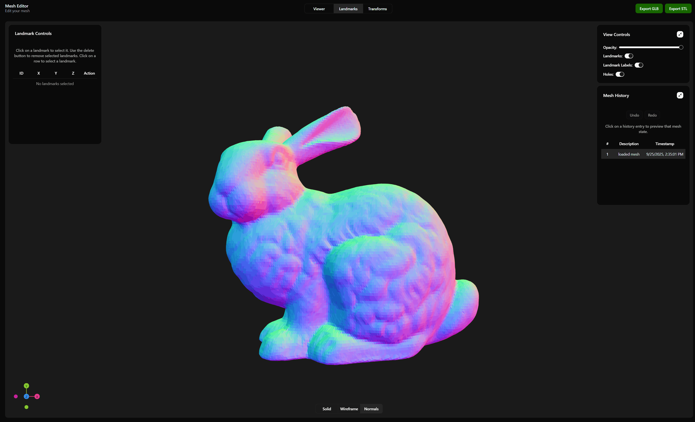

<div align="center">
 <h1>mesh-editor</h1>

<a href="https://www.npmjs.com/~@mv740/mesh-editor" target="_blank"></a>
<a href="https://www.npmjs.com/~@mv740/mesh-editor" target="_blank"></a>
<a href="https://github.com/mv740/mesh-editor/actions/workflows/test.yml" target="_blank"></a>

</div>

A powerful and interactive 3D mesh editor component for React. `mesh-editor` provides a comprehensive solution for viewing and manipulating 3D models directly in the browser.

## Features

- **3D Mesh Viewer**: Load and display 3D models in various formats.
- **Interactive 3D Mesh Editor**: A rich set of tools for mesh manipulation.
  - **State Management**: Undo/redo support for all editing operations (Ctrl+Z / Ctrl+Y).
  - **Landmarks**: Add, move, and delete landmarks on the mesh surface.
  - **Fill Holes**: Automatically detect and fill holes in the mesh.
  - **Clip Mesh**: Cut the mesh with a clipping plane.

## Installation

Install the published package for use in your application:

```bash
npm install @mv740/mesh-editor
```

## Demo

### Landmarks



### Clip/Fill hole


## Quick start (in a React app)

Import the component and CSS into your React app:

```tsx
import { MeshEditor } from '@mv740/mesh-editor'
import '@mv740/mesh-editor/style.css'

function MyEditor() {
  const [file, setFile] = useState<File | null>(null)

  // Load a mesh file into `file` (e.g. via an <input type="file" />)

  return (
    <div style={{ height: '100vh', width: '100vw' }}>
      <MeshEditor title="My Mesh Editor" inputSettings={{ file }} />
    </div>
  )
}
```

Notes:

- The `MeshEditor` accepts props such as `title` and `inputSettings`. See the source for additional options.
- Provide a container with explicit height/width so the WebGL canvas can size correctly.

## Development (run the playground)

Run the playground to develop locally and preview changes:

```bash
npm run playground
```

Open the URL printed by Vite (usually http://localhost:5173).

## Testing

Run unit tests (Vitest) and the end-to-end test:

```bash
npm test
```

There is a browser E2E test in `tests/` that requires a headless browser environment configured in CI.

## Building

To build the library for publishing:

```bash
npm run build
```

## Contributing

If you'd like to contribute, please open issues or pull requests. Follow the existing coding style and add unit tests for new features.
